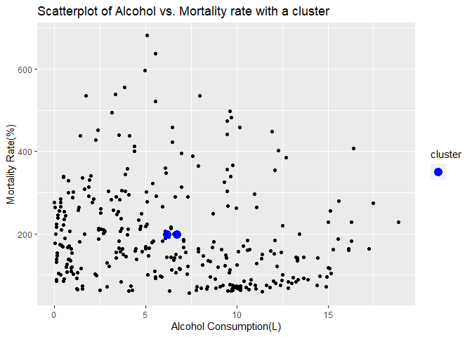

Relationship between Alcohol Consumption and Mortality Rate
================

The goal of this report is to find any relationship between alcohol
consumption and mortality rate. In order to do this, I have chosen the
dataset “Alcohol” and “Mortality”. Dataset Alcohol was composed of
variables “Country”, “Year” and “Alcohol”(in Liters). The variable
Alcohol represents the average amount of alcohol consumed among adult(15
years or older) population in the country. Dataset Mortality was
composed of variables “Country”, “Year”, “Both sexes”, “Male” and
“Female”. The variables Both sexes, Male and Female represents adult
mortality rate, or probability of dying between 15 and 60 years per 1000
population. Dataset Alcohol was provided with R packages while dataset
Mortality was acquired through kaggle.com. I have chosen these two
dataset because I pursue a career in the dental field. I could not find
a dataset on how alcohol consumption could affects one’s teeth, so I
decided to find out how alcohol would affect someone’s health in
general. I expect to find higher mortality rate in the countries that
have higher alcohol consumption. My dataset was already tidy so I did
not tidy them in R.

``` r
library(dplyr)
```

    ## 
    ## Attaching package: 'dplyr'

    ## The following objects are masked from 'package:stats':
    ## 
    ##     filter, lag

    ## The following objects are masked from 'package:base':
    ## 
    ##     intersect, setdiff, setequal, union

``` r
library(readxl)

Alcohol <- read_excel("C:/Users/okcij/Documents/R/Alcohol.xlsx")
Mortality<- read_excel("C:/Users/okcij/Documents/R/Mortality.xlsx")

Al_Mo <- inner_join(Alcohol, Mortality, by=c("Country","Year"))
#puts together two data by variables Country and Year
```

I joined dataset Alcohol and Mortality using inner join function. As a
result, countries that were found in Alcohol but not in Mortality was
dropped. Also, only the data from year 2005 to 2008 was kept because the
dataset Alcohol only contained years 2005-2008 with a few
exceptions(Sweden had dataset from years 2000-2004). Total of 2790 cases
from Mortality and 90 cases from Alcohol were dropped. I decided to use
inner join because dataset Mortality had total of 3111 cases while
dataset Alcohol only had 411 cases. If I used any other types of join, I
would’ve gotten too many N/A in the new dataset. It would’ve made many
cases in the dataset useless because I can’t compare two variables if
one of the variables is not available.

    ## -- Attaching packages --------------------------------------- tidyverse 1.3.0 --

    ## v ggplot2 3.3.3     v purrr   0.3.4
    ## v tibble  3.0.5     v stringr 1.4.0
    ## v tidyr   1.1.2     v forcats 0.5.0
    ## v readr   1.4.0

    ## -- Conflicts ------------------------------------------ tidyverse_conflicts() --
    ## x dplyr::filter() masks stats::filter()
    ## x dplyr::lag()    masks stats::lag()

    ## Joining, by = "Country"
    ## Joining, by = "Country"

    ## # A tibble: 321 x 7
    ##    Country              Year Alcohol BothSexes  Male Female Consumption
    ##    <chr>               <dbl>   <dbl>     <dbl> <dbl>  <dbl>       <dbl>
    ##  1 Sweden               2000    8.4         72    87     56   0.117    
    ##  2 Sweden               2001    9.1         72    88     55   0.126    
    ##  3 Sweden               2002    9.9         70    85     54   0.141    
    ##  4 Sweden               2003   10.2         68    83     53   0.15     
    ##  5 Sweden               2004   10.5         70    85     54   0.15     
    ##  6 Afghanistan          2005    0.02       277   296    258   0.0000722
    ##  7 Albania              2005    6.68       106   125     85   0.0630   
    ##  8 Algeria              2005    0.96       119   133    105   0.00807  
    ##  9 Angola               2005    5.4        323   358    288   0.0167   
    ## 10 Antigua and Barbuda  2005    7.22       156   187    125   0.0463   
    ## # ... with 311 more rows

    ## Adding missing grouping variables: `Year`

    ## # A tibble: 9 x 2
    ##    Year min_Alcohol
    ## * <dbl>       <dbl>
    ## 1  2000        8.4 
    ## 2  2001        9.1 
    ## 3  2002        9.9 
    ## 4  2003       10.2 
    ## 5  2004       10.5 
    ## 6  2005        0.02
    ## 7  2006        9.8 
    ## 8  2007        9.8 
    ## 9  2008        0.03

    ## Adding missing grouping variables: `Year`

    ## # A tibble: 9 x 2
    ##    Year max_Alcohol
    ## * <dbl>       <dbl>
    ## 1  2000         8.4
    ## 2  2001         9.1
    ## 3  2002         9.9
    ## 4  2003        10.2
    ## 5  2004        10.5
    ## 6  2005        16.3
    ## 7  2006         9.8
    ## 8  2007         9.8
    ## 9  2008        18.8

    ## Adding missing grouping variables: `Year`

    ## # A tibble: 9 x 2
    ##    Year mean_Alcohol
    ## * <dbl>        <dbl>
    ## 1  2000         8.4 
    ## 2  2001         9.1 
    ## 3  2002         9.9 
    ## 4  2003        10.2 
    ## 5  2004        10.5 
    ## 6  2005         6.32
    ## 7  2006         9.8 
    ## 8  2007         9.8 
    ## 9  2008         6.48

    ## Adding missing grouping variables: `Year`

    ## # A tibble: 9 x 2
    ##    Year median_Alcohol
    ## * <dbl>          <dbl>
    ## 1  2000           8.4 
    ## 2  2001           9.1 
    ## 3  2002           9.9 
    ## 4  2003          10.2 
    ## 5  2004          10.5 
    ## 6  2005           5.91
    ## 7  2006           9.8 
    ## 8  2007           9.8 
    ## 9  2008           5.92

    ## Adding missing grouping variables: `Year`

    ## # A tibble: 9 x 2
    ##    Year sd_Alcohol
    ## * <dbl>      <dbl>
    ## 1  2000      NA   
    ## 2  2001      NA   
    ## 3  2002      NA   
    ## 4  2003      NA   
    ## 5  2004      NA   
    ## 6  2005       4.52
    ## 7  2006      NA   
    ## 8  2007      NA   
    ## 9  2008       4.77

    ## `summarise()` has grouped output by 'Year'. You can override using the `.groups` argument.

    ## # A tibble: 45 x 2
    ## # Groups:   Year [9]
    ##     Year quantile_Alcohol
    ##    <dbl>            <dbl>
    ##  1  2000              8.4
    ##  2  2000              8.4
    ##  3  2000              8.4
    ##  4  2000              8.4
    ##  5  2000              8.4
    ##  6  2001              9.1
    ##  7  2001              9.1
    ##  8  2001              9.1
    ##  9  2001              9.1
    ## 10  2001              9.1
    ## # ... with 35 more rows

    ## Adding missing grouping variables: `Country`

    ## # A tibble: 321 x 2
    ## # Groups:   Country [157]
    ##    Country   Alcohol
    ##    <chr>       <dbl>
    ##  1 Belarus      18.8
    ##  2 Ukraine      17.5
    ##  3 Estonia      17.2
    ##  4 Uganda       16.4
    ##  5 Lithuania    16.3
    ##  6 Hungary      16.3
    ##  7 Romania      16.2
    ##  8 Hungary      16.1
    ##  9 Ukraine      15.6
    ## 10 Estonia      15.6
    ## # ... with 311 more rows

    ## Adding missing grouping variables: `Year`

    ## # A tibble: 9 x 2
    ##    Year min_BothSexes
    ## * <dbl>         <dbl>
    ## 1  2000            72
    ## 2  2001            72
    ## 3  2002            70
    ## 4  2003            68
    ## 5  2004            70
    ## 6  2005            61
    ## 7  2006            64
    ## 8  2007            63
    ## 9  2008            57

    ## Adding missing grouping variables: `Year`

    ## # A tibble: 9 x 2
    ##    Year max_BothSexes
    ## * <dbl>         <dbl>
    ## 1  2000            72
    ## 2  2001            72
    ## 3  2002            70
    ## 4  2003            68
    ## 5  2004            70
    ## 6  2005           681
    ## 7  2006            64
    ## 8  2007            63
    ## 9  2008           596

    ## # A tibble: 9 x 2
    ##    Year mean_BothSexes
    ## * <dbl>          <dbl>
    ## 1  2000            72 
    ## 2  2001            72 
    ## 3  2002            70 
    ## 4  2003            68 
    ## 5  2004            70 
    ## 6  2005           209.
    ## 7  2006            64 
    ## 8  2007            63 
    ## 9  2008           193.

    ## # A tibble: 9 x 2
    ##    Year median_BothSexes
    ## * <dbl>            <dbl>
    ## 1  2000               72
    ## 2  2001               72
    ## 3  2002               70
    ## 4  2003               68
    ## 5  2004               70
    ## 6  2005              179
    ## 7  2006               64
    ## 8  2007               63
    ## 9  2008              165

    ## # A tibble: 9 x 2
    ##    Year sd_BothSexes
    ## * <dbl>        <dbl>
    ## 1  2000          NA 
    ## 2  2001          NA 
    ## 3  2002          NA 
    ## 4  2003          NA 
    ## 5  2004          NA 
    ## 6  2005         127.
    ## 7  2006          NA 
    ## 8  2007          NA 
    ## 9  2008         110.

    ## `summarise()` has grouped output by 'Year'. You can override using the `.groups` argument.

    ## # A tibble: 45 x 2
    ## # Groups:   Year [9]
    ##     Year quantile_BothSexes
    ##    <dbl>              <dbl>
    ##  1  2000                 72
    ##  2  2000                 72
    ##  3  2000                 72
    ##  4  2000                 72
    ##  5  2000                 72
    ##  6  2001                 72
    ##  7  2001                 72
    ##  8  2001                 72
    ##  9  2001                 72
    ## 10  2001                 72
    ## # ... with 35 more rows

    ## Adding missing grouping variables: `Country`

    ## # A tibble: 321 x 2
    ## # Groups:   Country [157]
    ##    Country                  mean_BothSexes
    ##    <chr>                             <dbl>
    ##  1 Zimbabwe                           638.
    ##  2 Zimbabwe                           638.
    ##  3 Lesotho                            579 
    ##  4 Lesotho                            579 
    ##  5 Central African Republic           517 
    ##  6 Central African Republic           517 
    ##  7 Zambia                             498.
    ##  8 Zambia                             498.
    ##  9 Malawi                             486.
    ## 10 Malawi                             486.
    ## # ... with 311 more rows

    ## # A tibble: 1 x 1
    ##   `cor(Alcohol, BothSexes, use = "pairwise.complete.obs")`
    ##                                                      <dbl>
    ## 1                                                   -0.172

``` r
#           Alcohol(2005) |  Alcohol(2008)  |Mortality(2005)|Mortality(2008)
#---------------------------------------------------------------------------
#Minimum|0.02(Afghanistan)|0.03(Afghanistan)|  61(Iceland)  | 57(Iceland)
#---------------------------------------------------------------------------
#Maximum| 16.27(Hungary)  | 18.85(Belarus)  | 681(Zimbabwe) | 596(Zimbabwe)
#---------------------------------------------------------------------------
#Mean   |      6.319      |      6.479      |    208.987    |    192.731
#---------------------------------------------------------------------------
#Median |       5.91      |       5.92      |      179      |      165
#---------------------------------------------------------------------------
#SD     |      4.522      |      4.773      |    127.253    |    110.126
```

Years 2000, 2001, 2002, 2003, 2004, 2006 and 2007 were not included
because only data from Swiss was available. Since no other countries had
data on those years it was determined that it would be more sufficient
to exclude the data.

Afghanistan consumed the least amount of alcohol in both 2005 and 2008.
Hungray consumed the most amount of alcohol in 2005 and Belarus consumed
the most amount of alcohol in 2008. Iceland had the lowest mortality
rate in both 2005 and 2008 while Zimbabwe had the highest mortality rate
in both 2005 and 2008.

Mean of Alcohol in 2008 was slightly higher than mean of alcohol in 2005
while mean of Mortality in 2008 was lower than mean of 2005. Median and
SD for variable Alcohol did not show much change from year 2005 to 2008,
while the variable Mortality showed greater amount of decrease. This
could indicate that alcohol consumption increased over the years while
the mortality rate decreased.

Variable Alcohol and Mortality(written as BothSexes in data) had
correlation coefficient of -0.17, which means that mortality rate
increases as the alcohol consumption decreases.

``` r
Al_Mo_num <- Al_Mo %>%
  select_if(is.numeric)
  #creates a new data with only numeric variables

cor(Al_Mo_num, use = "pairwise.complete.obs") %>%
  #saves as data
  as.data.frame %>%
  #converts each row to a variable
  rownames_to_column %>%
  #all correlations appear in the same column
  pivot_longer(-1, names_to = "other_var", values_to = "correlation") %>%
  ggplot(aes(rowname, other_var, fill=correlation)) +
  geom_tile() +
  #changes the scale for a neutral appeal
  scale_fill_gradient2(low="blue",mid="white",high="red") +
  #overlays the values
  geom_text(aes(label = round(correlation,2)), color = "black", size = 4) +
  labs(title = "Correlation matrix for the dataset Al_Mo", x = "variable 1", y = "variable 2")
```

<!-- -->

``` r
  #writes title and labels the axis
```

This correlation heatmap shows that mortality rate and alcohol
consumption has very weak relationship. Males have almost no
relationship with alcohol consumption because the correlation
coefficient is -0.09, which is very close to 0. Although females have a
slightly stronger correlation coefficient than males, the value is only
-0.24 which still indicates a weak relationship between alcohol
consumption and mortality rate of females.

``` r
ggplot(Al_Mo_final, aes(x=BothSexes, y=Alcohol, color=Country)) +
  geom_point(show.legend=FALSE) +
  #creates a scatter plot
  labs(title="Scatter Plot of Alcohol and Mortality Rate by different Country", x="Mortality Rate(%)", y="Alcohol consumption(L)") 
```

<!-- -->

A legend was deleted because there were too many countries and the graph
did not appear if a legend was present.There is no correlation between
alcohol consumption and mortality rate because the data is too scattered
without a pattern and thus a slope cannot be drawn.

``` r
ggplot(Al_Mo_final, aes(x=Country, y=Alcohol, color=mean_Alcohol)) +
  geom_bar(stat="identity", width=0.1) +
  #creates a barplot
  theme(axis.text.x=element_blank()) +
  labs(title="Bargraph of Alcohol consumption by different Country", x="Country", y="Alcohol consumption(L)")
```

<!-- -->

Countries in x-axis was not labeled because there were too many
countries and labeling them made the x-axis not readable. The bars were
colored according to their mean alcohol consumption, with lighter blue
having a higher mean while darker blue having a lower mean. Belarus had
the highest mean alcohol consumption while Afghanistan had the lowest
mean alcohol consumption.

``` r
library(cluster)

Al_Mo_k <- Al_Mo %>%
  mutate(cluster=sample(c('1','2'), 321, replace=T)) %>%
  #randomly assigns 1 of 2 clusters to the 321 observations
  group_by(cluster) %>%
  summarize(Alcohol=mean(Alcohol), BothSexes=mean(BothSexes))
  #finds centers with means

ggplot(Al_Mo) + 
  geom_point(aes(Alcohol, BothSexes)) +
  geom_point(data = Al_Mo_k, aes(Alcohol, BothSexes,fill=""), color="blue", size=4) +
  scale_fill_manual(name="cluster", values = "black") +
  labs(title="Scatterplot of Alcohol vs. Mortality rate with a cluster",
       x="Alcohol Consumption(L)", y="Mortality Rate(%)")
```

<!-- -->

Final number of clusters, which was two, was determined considering that
only two variable are being compared. There were no groups found using
the clusters, which means there is no relationship between mortality
rate and alcohol consumption.

``` r
Al_Mo_distance <- Al_Mo %>%
  #attributes observation to cluster in terms of distances
  mutate(dist1 = sqrt((Alcohol - Al_Mo_k$Alcohol[1])^2 + (BothSexes - Al_Mo_k$BothSexes[1])^2),
         dist2 = sqrt((Alcohol - Al_Mo_k$Alcohol[2])^2 + (BothSexes - Al_Mo_k$BothSexes[2])^2)) %>%
  #calculates distances between each observation and the center of each cluster
  rowwise() %>% 
  #caculates by row
  mutate(cluster = which.min(c(dist1,dist2))) %>%
  #chooses the cluster with the minimum distance
  ungroup()
  #stops the calculations by rows

Al_Mo_Centers <- Al_Mo_distance %>%
  group_by(cluster) %>%
  summarize(Alcohol = mean(Alcohol), BothSexes = mean(BothSexes))
  #calculates the new centers

ggplot(Al_Mo_distance) +
  geom_point(aes(Alcohol, BothSexes, color = as.factor(cluster))) +
  geom_point(data = Al_Mo_k, aes(Alcohol,BothSexes), color="black", size=4)+
  labs(title="Scatterplot of Alcohol vs. Mortality rate with new clusters",
       x="Alcohol Consumption(L)", y="Mortality Rate(%)")
```

<!-- -->

``` r
  #plots new centers with clusters
```

From this scatterplot, we can conclude that there is no considerable
relationship between alcohol consumption and mortality rate because
there was no significant improvement. Although women have slightly
higher correlation coefficient compared to men, the value is not
considerably high.
